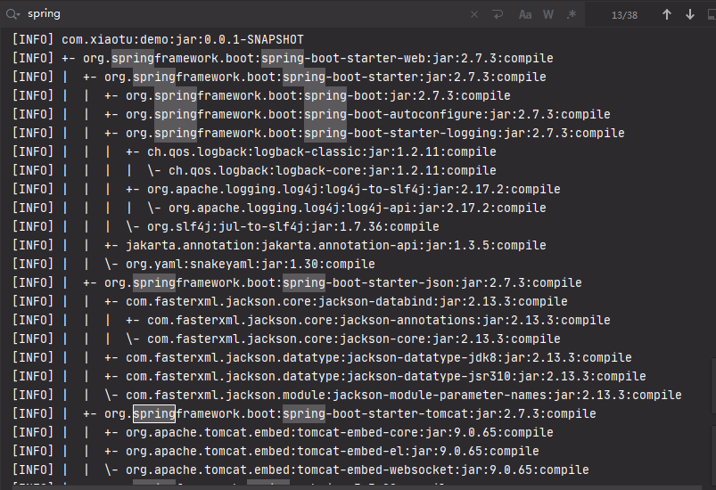
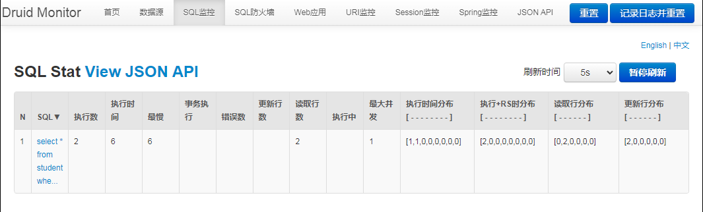

# 03.Spring-Boot-MyBatis


### mybatis-spring-boot-starter

在pom中引入

```xml
<dependency>
    <groupId>org.springframework.boot</groupId>
    <artifactId>spring-boot-starter</artifactId>
    <version>2.7.3</version>
</dependency>
```


不同版本的Spring Boot和MyBatis版本对应不一样，具体可查看官方文档：http://www.mybatis.org/spring-boot-starter/mybatis-spring-boot-autoconfigure/。


使用 *mvn dependency:tree*命令查看`mybatis-spring-boot-starter`都有哪些隐性依赖




### 引入mysql


```xml
<dependency>
    <groupId>mysql</groupId>
    <artifactId>mysql-connector-java</artifactId>
    <version>8.0.28</version>
</dependency>
```


### Druid数据源

Druid是一个关系型数据库连接池，是阿里巴巴的一个开源项目，地址：https://github.com/alibaba/druid。Druid不但提供连接池的功能，还提供监控功能，可以实时查看数据库连接池和SQL查询的工作情况。


引入依赖

```xml
<dependency>
    <groupId>com.alibaba</groupId>
    <artifactId>druid-spring-boot-starter</artifactId>
    <version>1.1.13</version>
</dependency>
```


Druid数据源配置

上面通过查看mybatis starter的隐性依赖发现，Spring Boot的数据源配置的默认类型是`org.apache.tomcat.jdbc.pool.Datasource`，为了使用Druid连接池，需要在application.yml下配置：

```yaml
spring:
  datasource:
    druid:
      #spring.datasource.url=jdbc:mysql://localhost:3306/xiaotu?useSSL=false
      #spring.datasource.username=root
      # 数据库访问配置, 使用druid数据源
      type: com.alibaba.druid.pool.DruidDataSource
      driver-class-name: com.mysql.cj.jdbc.Driver
      url: jdbc:mysql://localhost:3306/xiaotu?useSSL=false
      username: root
      password: root
      # 连接池配置
      initial-size: 5
      min-idle: 5
      max-active: 20
      # 连接等待超时时间
      max-wait: 30000
      # 配置检测可以关闭的空闲连接间隔时间
      time-between-eviction-runs-millis: 60000
      # 配置连接在池中的最小生存时间
      min-evictable-idle-time-millis: 300000
      validation-query: select '1' from dual
      test-while-idle: true
      test-on-borrow: false
      test-on-return: false
      # 打开PSCache，并且指定每个连接上PSCache的大小
      pool-prepared-statements: true
      max-open-prepared-statements: 20
      max-pool-prepared-statement-per-connection-size: 20
      # 配置监控统计拦截的filters, 去掉后监控界面sql无法统计, 'wall'用于防火墙
      filters: stat,wall
      # Spring监控AOP切入点，如x.y.z.service.*,配置多个英文逗号分隔
      aop-patterns: com.springboot.servie.*


      # WebStatFilter配置
      web-stat-filter:
        enabled: true
        # 添加过滤规则
        url-pattern: /*
        # 忽略过滤的格式
        exclusions: '*.js,*.gif,*.jpg,*.png,*.css,*.ico,/druid/*'

      # StatViewServlet配置
      stat-view-servlet:
        enabled: true
        # 访问路径为/druid时，跳转到StatViewServlet
        url-pattern: /druid/*
        # 是否能够重置数据
        reset-enable: false
        # 需要账号密码才能访问控制台
        login-username: druid
        login-password: druid
        # IP白名单
        # allow: 127.0.0.1
        #　IP黑名单（共同存在时，deny优先于allow）
        # deny: 192.168.1.218

      # 配置StatFilter
      filter:
        stat:
          log-slow-sql: true

debug: true
```


上述配置不但配置了Druid作为连接池，而且还开启了Druid的监控功能。 其他配置可参考官方wiki——https://github.com/alibaba/druid/tree/master/druid-spring-boot-starter

此时，运行项目，访问http://localhost:8080/druid：


### 使用MyBatis

使用数据库

```mysql
CREATE TABLE STUDENT (
    SNO VARCHAR(3) NOT NULL ,
    SNAME VARCHAR(9) NOT NULL ,
    SSEX CHAR(2) NOT NULL
);
INSERT INTO STUDENT VALUES ('001', 'KangKang', 'M ');
INSERT INTO STUDENT VALUES ('002', 'Mike', 'M ');
INSERT INTO STUDENT VALUES ('003', 'Jane', 'F ');
```


创建实体类Student

```java
public class Student implements Serializable {

    private static final long serialVersionUID = -339516038496531943L;

    private String sno;
    private String name;
    private String sex;
	
	//...set and get
}  
```


创建CURD的Mapper

```
public interface StudentMapper {
    int add(Student student);
    int update(Student student);
    int deleteBySno(String sno);
    Student queryStudentBySno(String sno);
}
```


使用注解实现Mapper映射SQL

```java
@Component
@Mapper
public interface StudentMapper {

    @Insert("insert into student(sno,sname,ssex) values(#{sno},#{name},#{sex})")
    int add(Student student);

    @Update("update student set sname=#{name},ssex=#{sex} where sno=#{sno}")
    int update(Student student);

    @Delete("delete from student where sno=#{sno}")
    int deleteBySno(String sno);

    @Select("select * from student where sno=#{sno}")
    @Results(id = "student",value= {
            @Result(property = "sno", column = "sno", javaType = String.class),
            @Result(property = "name", column = "sname", javaType = String.class),
            @Result(property = "sex", column = "ssex", javaType = String.class)
    })
    Student queryStudentBySno(String sno);
}
```


编写service接口

```java
public interface StudentService {
    int add(Student student);
    int update(Student student);
    int deleteBySno(String sno);
    Student queryStudentBySno(String sno);
}
```


实现service类StudentServiceImp

```java
@Service("studentService")
public class StudentServiceImp implements StudentService {

    @Autowired
    private StudentMapper studentMapper;

    @Override
    public int add(Student student) {
        return studentMapper.add(student);
    }

    @Override
    public int update(Student student) {
        return studentMapper.update(student);
    }

    @Override
    public int deleteBySno(String sno) {
        return studentMapper.deleteBySno(sno);
    }

    @Override
    public Student queryStudentBySno(String sno) {
        return studentMapper.queryStudentBySno(sno);
    }
}
```


编写测试类

```java
@RestController
public class TestController {
    @Autowired
    private StudentService studentService;

    @RequestMapping( value = "/querystudent", method = RequestMethod.GET)
    public Student queryStudentBySno(String sno) {
        System.out.println("sno + "+ sno);
        System.out.println( this.studentService.queryStudentBySno(sno));

        return this.studentService.queryStudentBySno(sno);
    }
}
```


访问 

测试查询：http://localhost:8080/querystudent?sno=001


druid监控web：http://localhost:8080/druid/index.html




