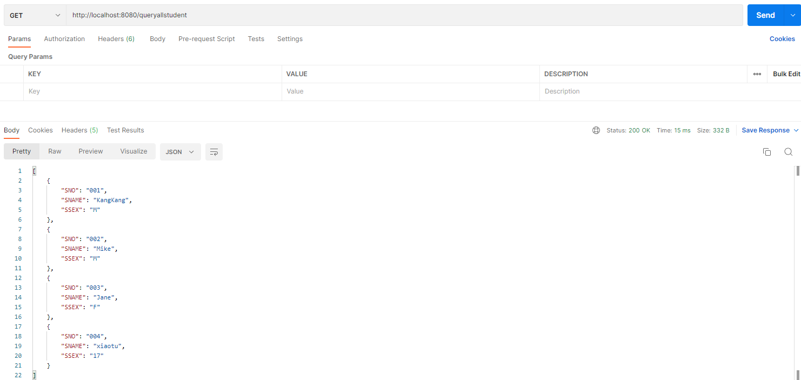
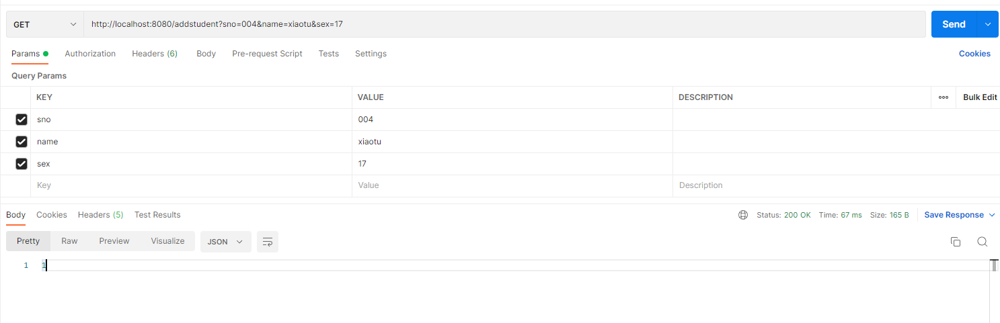

# 04.Spring-Boot-JdbcTemplate

1.pom引入JdbcTemplate

```xml
<dependency>
    <groupId>org.springframework.boot</groupId>
    <artifactId>spring-boot-starter-jdbc</artifactId>
</dependency>
```


2.同步03案例中的配置文件application.yml和bean


3.实现dao层

studentDao

```java
public interface StudentDao {
    int add(Student student);
    int update(Student student);
    int deleteBySno(String sno);
    List<Map<String,Object>> queryStudentsListMap();
    Student queryStudentBySno(String sno);
}
```

StudentDaoImp

```java

@Repository("studentDao")
public class StudentDaoImp implements StudentDao {

    @Autowired
    private JdbcTemplate jdbcTemplate;

    @Override
    public int add(Student student) {
        // String sql = "insert into student(sno,sname,ssex) values(?,?,?)";
        // Object[] args = { student.getSno(), student.getName(), student.getSex() };
        // int[] argTypes = { Types.VARCHAR, Types.VARCHAR, Types.VARCHAR };
        // return this.jdbcTemplate.update(sql, args, argTypes);

        String sql = "insert into student(sno,sname,ssex) values(:sno,:name,:sex)";
        NamedParameterJdbcTemplate npjt = new NamedParameterJdbcTemplate(jdbcTemplate.getDataSource());
        return npjt.update(sql, new BeanPropertySqlParameterSource(student));
    }

    @Override
    public int update(Student student) {
        String sql = "update student set sname = ?,ssex = ? where sno = ?";
        Object[] args = { student.getName(), student.getSex(), student.getSno() };
        int[] argTypes = { Types.VARCHAR, Types.VARCHAR, Types.VARCHAR };
        return this.jdbcTemplate.update(sql, args, argTypes);
    }

    @Override
    public int deleteBySno(String sno) {
        String sql = "delete from student where sno = ?";
        Object[] args = { sno };
        int[] argTypes = { Types.VARCHAR };
        return this.jdbcTemplate.update(sql, args, argTypes);
    }

    @Override
    public List<Map<String, Object>> queryStudentsListMap() {
        String sql = "select * from student";
        return this.jdbcTemplate.queryForList(sql);
    }

    @Override
    public Student queryStudentBySno(String sno) {
        String sql = "select * from student where sno = ?";
        Object[] args = { sno };
        int[] argTypes = { Types.VARCHAR };
        List<Student> studentList = this.jdbcTemplate.query(sql, args, argTypes, new StudentMapper());
        if (studentList != null && studentList.size() > 0) {
            return studentList.get(0);
        } else {
            return null;
        }
    }
}
```


studentMapper

```java
@Component
public class StudentMapper implements RowMapper<Student> {
    @Override
    public Student mapRow(ResultSet rs, int rowNum) throws SQLException {
        Student student = new Student();
        student.setSno(rs.getString("sno"));
        student.setName(rs.getString("sname"));
        student.setSex(rs.getString("ssex"));
        return student;
    }
}
```


4.service

```java
@Service("studentService")
public class StudentServiceImp implements StudentService {

    @Autowired
    private StudentDao studentDao;


    @Override
    public int add(Student student) {
        return studentDao.add(student);
    }

    @Override
    public int update(Student student) {
        return studentDao.update(student);
    }

    @Override
    public int deleteBySno(String sno) {
        return studentDao.deleteBySno(sno);
    }

    @Override
    public List<Map<String, Object>> queryStudentListMap() {
        return studentDao.queryStudentsListMap();
    }

    @Override
    public Student queryStudentBySno(String sno) {
        return studentDao.queryStudentBySno(sno);
    }
}
```


各接口如下








