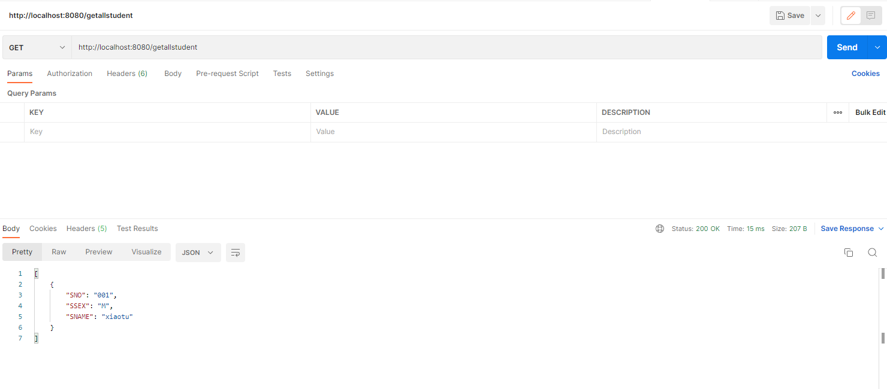
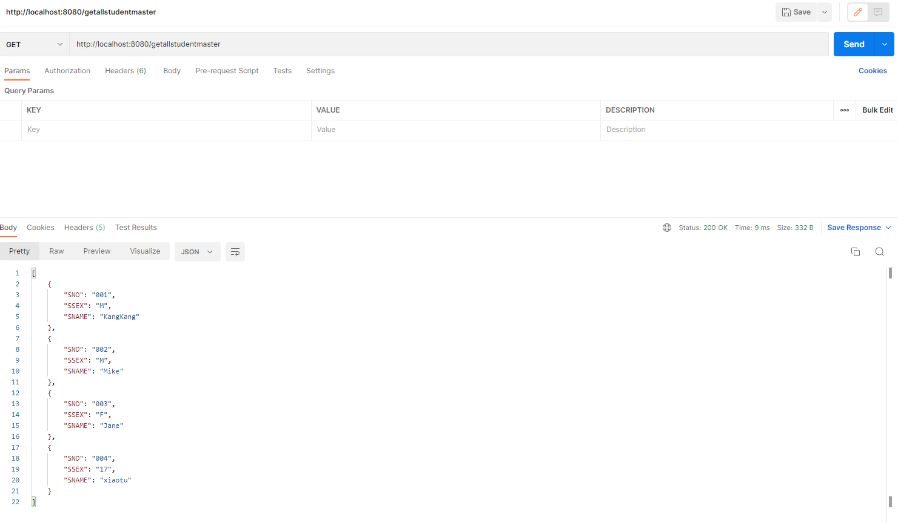

# 05.Spring-Boot-MyBatis-MultiDataSource

Spring中配置MyBatis SqlSessionFactory

```xml
<!-- mybatis 的SqlSessionFactory -->
<bean id="SqlSessionFactory" class="org.mybatis.spring.SqlSessionFactoryBean" scope="prototype">
    <property name="dataSource" ref="dataSource"/>
    <property name="configLocation" value="classpath:mybatis-config.xml"/>
</bean>
```

所以实际上在Spring Boot中配置MyBatis多数据源的关键在于创建SqlSessionFactory的时候为其分配不同的数据源

## 引入依赖

```xml
<dependency>
    <groupId>org.springframework.boot</groupId>
    <artifactId>spring-boot-starter</artifactId>
</dependency>
<dependency>
    <groupId>org.mybatis.spring.boot</groupId>
    <artifactId>mybatis-spring-boot-starter</artifactId>
    <version>1.3.2</version>
</dependency>
<dependency>
    <groupId>mysql</groupId>
    <artifactId>mysql-connector-java</artifactId>
</dependency>
<dependency>
    <groupId>com.alibaba</groupId>
    <artifactId>druid-spring-boot-starter</artifactId>
    <version>1.1.13</version>
</dependency>
```


## 多数据源配置

在Spring Boot配置文件application.yml中配置多数据源和Spring Boot JdbcTemplate配置Druid多数据源一致。

然后根据application.yml创建两个数据源配置类MasterDatasourceConfig和SlaveDatasourceConfig：

```java
@Configuration
@MapperScan(basePackages  = MasterDatasourceConfig.PACKAGE, sqlSessionFactoryRef = "masterSqlSessionFactory")
public class MasterDatasourceConfig {

    // mysqldao扫描路径
    public static final String PACKAGE = "com.xiaotu.multidata.masterdao";
    // mybatis mapper扫描路径
    public static final String MAPPER_LOCATION = "classpath:mapper/master/*.xml";

    @Primary
    @Bean(name = "masterDataSource")
    @ConfigurationProperties("spring.datasource.druid.master")
    public DataSource mysqlDataSource() {
        return DruidDataSourceBuilder.create().build();
    }

    @Primary
    @Bean(name = "masterTransactionManager")
    public DataSourceTransactionManager masterTransactionManager() {
        return new DataSourceTransactionManager(mysqlDataSource());
    }

    @Primary
    @Bean(name = "masterSqlSessionFactory")
    public SqlSessionFactory masterSqlSessionFactory(@Qualifier("masterDataSource") DataSource dataSource)
            throws Exception {
        final SqlSessionFactoryBean sessionFactory = new SqlSessionFactoryBean();
        sessionFactory.setDataSource(dataSource);
        //如果不使用xml的方式配置mapper，则可以省去下面这行mapper location的配置。
        sessionFactory.setMapperLocations(
                new PathMatchingResourcePatternResolver().getResources(MasterDatasourceConfig.MAPPER_LOCATION));
        return sessionFactory.getObject();
    }
}
```


```java
@Configuration
@MapperScan(basePackages  = SlaveDatasourceConfig.PACKAGE, sqlSessionFactoryRef = "slaveSqlSessionFactory")
public class SlaveDatasourceConfig {
    // mysqldao扫描路径
    public static final String PACKAGE = "com.xiaotu.multidata.slavedao";
    // mybatis mapper扫描路径
    public static final String MAPPER_LOCATION = "classpath:mapper/slave/*.xml";

    @Primary
    @Bean(name = "slaveDataSource")
    @ConfigurationProperties("spring.datasource.druid.slave")
    public DataSource mysqlDataSource() {
        return DruidDataSourceBuilder.create().build();
    }

    @Primary
    @Bean(name = "slaveTransactionManager")
    public DataSourceTransactionManager slaveTransactionManager() {
        return new DataSourceTransactionManager(mysqlDataSource());
    }

    @Bean(name = "slaveSqlSessionFactory")
    public SqlSessionFactory slaveSqlSessionFactory(@Qualifier("slaveDataSource") DataSource dataSource)
            throws Exception {
        final SqlSessionFactoryBean sessionFactory = new SqlSessionFactoryBean();
        sessionFactory.setDataSource(dataSource);
        //如果不使用xml的方式配置mapper，则可以省去下面这行mapper location的配置。
        sessionFactory.setMapperLocations(
                new PathMatchingResourcePatternResolver().getResources(SlaveDatasourceConfig.MAPPER_LOCATION));
        return sessionFactory.getObject();
    }
}
```


在service的实现类里调用不同的dao

```java
@Service("studentService")
public class StudentServiceImp implements StudentService {

    @Autowired
    private MasterStudentMapper masterStudentMapper;
    @Autowired
    private SlaveStudentMapper slaveStudentMapper;


    @Override
    public int add(Student student) {
        return masterStudentMapper.add(student);
    }

    @Override
    public int update(Student student) {
        return masterStudentMapper.update(student);
    }

    @Override
    public int deleteBySno(String sno) {
        return masterStudentMapper.deleteBySno(sno);
    }

    @Override
    public Student queryStudentBySno(String sno) {
       return masterStudentMapper.queryStudentBySno(sno);
    }

    @Override
    public List<Map<String, Object>> getAllStudents() {
        return slaveStudentMapper.getAllStudents();
    }


    public List<Map<String, Object>> getAllStudentsFromMaster() {
        return masterStudentMapper.getAllStudents();
    }

}
```


测试结果





