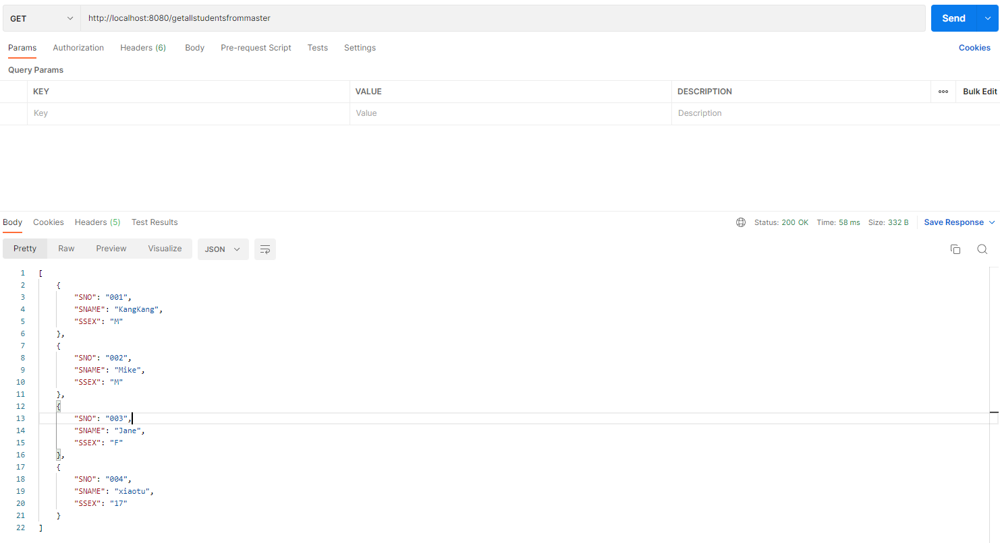
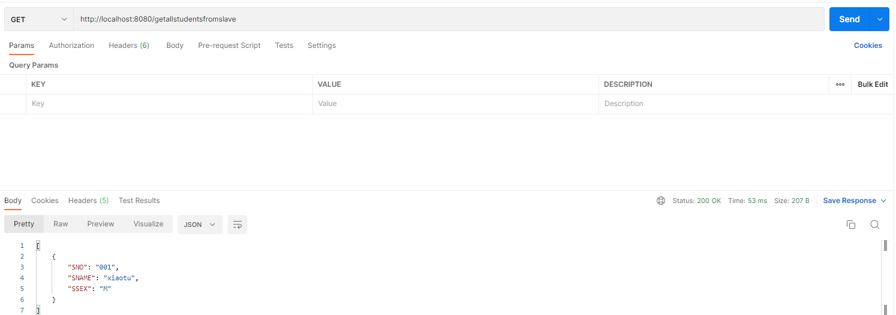

# 06.Spring-Boot-JdbcTemplate-MultiDataSource

JdbcTemplate配置Druid多数据源的核心在于创建JdbcTemplate时候为其分配不同的数据源，然后在需要访问不同数据库的时候使用对应的JdbcTemplate即可。这里介绍在Spring Boot中基于Oracle和Mysql配置Druid多数据源。

## 引入依赖

```xml
<dependency>
    <groupId>org.springframework.boot</groupId>
    <artifactId>spring-boot-starter-jdbc</artifactId>
</dependency>
```


## 多数据源配置

接着在Spring Boot配置文件application.yml中配置多数据源：

```yml
erver:
  context-path: /web

spring:
  datasource:
    # 数据库访问配置, 使用druid数据源
    # 数据源1 mysql
    master:
      type: com.alibaba.druid.pool.DruidDataSource
      driver-class-name: com.mysql.cj.jdbc.Driver
      url: jdbc:mysql://localhost:3306/xiaotu?useUnicode=true&characterEncoding=UTF-8&rewriteBatchedStatements=true&autoReconnect=true&failOverReadOnly=false&zeroDateTimeBehavior=convertToNull
      username: root
      password: root
    # 数据源2 oracle
    slave:
      type: com.alibaba.druid.pool.DruidDataSource
      driver-class-name: com.mysql.cj.jdbc.Driver
      url: jdbc:mysql://localhost:3306/tx?useUnicode=true&characterEncoding=UTF-8&rewriteBatchedStatements=true&autoReconnect=true&failOverReadOnly=false&zeroDateTimeBehavior=convertToNull
      username: root
      password: root
    druid:
      # 连接池配置
      initial-size: 5
      min-idle: 5
      max-active: 20
      # 连接等待超时时间
      max-wait: 30000
      # 配置检测可以关闭的空闲连接间隔时间
      time-between-eviction-runs-millis: 60000
      # 配置连接在池中的最小生存时间
      min-evictable-idle-time-millis: 300000
      validation-query: select '1'
      test-while-idle: true
      test-on-borrow: false
      test-on-return: false
      # 打开PSCache，并且指定每个连接上PSCache的大小
      pool-prepared-statements: true
      max-open-prepared-statements: 20
      max-pool-prepared-statement-per-connection-size: 20
      # 配置监控统计拦截的filters, 去掉后监控界面sql无法统计, 'wall'用于防火墙
      filters: stat,wall
      # Spring监控AOP切入点，如x.y.z.service.*,配置多个英文逗号分隔
      aop-patterns: com.springboot.servie.*


      # WebStatFilter配置
      web-stat-filter:
        enabled: true
        # 添加过滤规则
        url-pattern: /*
        # 忽略过滤的格式
        exclusions: '*.js,*.gif,*.jpg,*.png,*.css,*.ico,/druid/*'

      # StatViewServlet配置
      stat-view-servlet:
        enabled: true
        # 访问路径为/druid时，跳转到StatViewServlet
        url-pattern: /druid/*
        # 是否能够重置数据
        reset-enable: false
        # 需要账号密码才能访问控制台
        login-username: druid
        login-password: druid1
        # IP白名单
        # allow: 127.0.0.1
        #　IP黑名单（共同存在时，deny优先于allow）
        # deny: 192.168.1.218

      # 配置StatFilter
      filter:
        stat:
          log-slow-sql: true
```


然后创建一个多数据源配置类，根据application.yml分别配置一个Master和Slave的数据源，并且将这两个数据源注入到两个不同的JdbcTemplate中：

```java
@Configuration
public class DataSourceConfig {
    @Primary
    @Bean(name = "masterdatasource")
    @ConfigurationProperties("spring.datasource.master")
    public DataSource dataSourceOne(){
        return DruidDataSourceBuilder.create().build();
    }

    @Primary
    @Bean(name = "slavedatasource")
    @ConfigurationProperties("spring.datasource.slave")
    public DataSource dataSourceTwo(){
        return DruidDataSourceBuilder.create().build();
    }

    @Bean(name = "masterJdbcTemplate")
    public JdbcTemplate primaryJdbcTemplate(
            @Qualifier("masterdatasource") DataSource dataSource) {
        return new JdbcTemplate(dataSource);
    }

    @Bean(name = "slaveJdbcTemplate")
    public JdbcTemplate secondaryJdbcTemplate(
            @Qualifier("slavedatasource") DataSource dataSource) {
        return new JdbcTemplate(dataSource);
    }

}
```


上述代码根据application.yml创建了masterdatasource和slavedatasource数据源，其中mysqldatasource用`@Primary`标注为主数据源，接着根据这两个数据源创建了masterJdbcTemplate和slaveJdbcTemplate。

`@Primary`标志这个Bean如果在多个同类Bean候选时，该Bean优先被考虑。多数据源配置的时候，必须要有一个主数据源，用`@Primary`标志该Bean。

数据源创建完毕，接下来开始进行测试代码编写。

使用不同的JdbcTemplate实现dao层

```java
@Repository("masterStudentDao")
public class MasterStudentDaoImp implements MasterStudentDao {

    // 另外一个使用slaveJdbcTemplate
    @Autowired
    private JdbcTemplate masterJdbcTemplate;

    @Override
    public int add(Student student) {
        // String sql = "insert into student(sno,sname,ssex) values(?,?,?)";
        // Object[] args = { student.getSno(), student.getName(), student.getSex() };
        // int[] argTypes = { Types.VARCHAR, Types.VARCHAR, Types.VARCHAR };
        // return jdbcTemplate.update(sql, args, argTypes);

        String sql = "insert into student(sno,sname,ssex) values(:sno,:name,:sex)";
        NamedParameterJdbcTemplate npjt = new NamedParameterJdbcTemplate(masterJdbcTemplate.getDataSource());
        return npjt.update(sql, new BeanPropertySqlParameterSource(student));
    }

    @Override
    public int update(Student student) {
        String sql = "update student set sname = ?,ssex = ? where sno = ?";
        Object[] args = { student.getName(), student.getSex(), student.getSno() };
        int[] argTypes = { Types.VARCHAR, Types.VARCHAR, Types.VARCHAR };
        return masterJdbcTemplate.update(sql, args, argTypes);
    }

    @Override
    public int deleteBySno(String sno) {
        String sql = "delete from student where sno = ?";
        Object[] args = { sno };
        int[] argTypes = { Types.VARCHAR };
        return masterJdbcTemplate.update(sql, args, argTypes);
    }

    @Override
    public List<Map<String, Object>> getAllStudents() {
        String sql = "select * from student";
        return masterJdbcTemplate.queryForList(sql);
    }

    @Override
    public Student queryStudentBySno(String sno) {
        String sql = "select * from student where sno = ?";
        Object[] args = { sno };
        int[] argTypes = { Types.VARCHAR };
        List<Student> studentList = masterJdbcTemplate.query(sql, args, argTypes, new StudentMapper());
        if (studentList != null && studentList.size() > 0) {
            return studentList.get(0);
        } else {
            return null;
        }
    }
}
```


StudentService接口：

```java
public interface StudentService {
    //写mysql1
    List<Map<String, Object>> getAllStudentsFromMaster();
    List<Map<String, Object>> getAllStudentsFromSlave();
}
```


StudentService实现：

```java
@Service("studentService")
public class StudentServiceImp implements StudentService{

    @Autowired
    private MasterStudentDao masterStudentDao;

    @Autowired
    private SlaveStudentDao slaveStudentDao;

    @Override
    public List<Map<String, Object>> getAllStudentsFromMaster() {
        return masterStudentDao.getAllStudents();
    }

    @Override
    public List<Map<String, Object>> getAllStudentsFromSlave() {
        return slaveStudentDao.getAllStudents();
    }
}
```


controller

```java
@RestController
public class IndexController {

    @Autowired
    private StudentService studentService;

    @GetMapping("getallstudentsfrommaster")
    public List<Map<String, Object>> index1(){
        return studentService.getAllStudentsFromMaster();
    }

    @GetMapping("getallstudentsfromslave")
    public List<Map<String, Object>> index2(){
        return studentService.getAllStudentsFromSlave();
    }
}
```

测试



