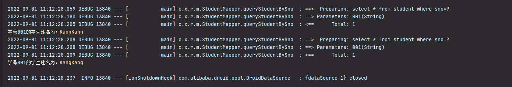

## 09.Spring-Boot-Redis-Cache

在程序中可以使用缓存的技术来节省对数据库的开销。Spring Boot对缓存提供了很好的支持，我们几乎不用做过多的配置即可使用各种缓存实现。这里主要介绍平日里个人接触较多的Ehcache和Redis缓存实现。


## 准备工作

可根据Spring-Boot中使用Mybatis搭建一个Spring Boot项目，然后yml中配置日志输出级别以观察SQL的执行情况：

```yml
//为项目mapper路径
logging:
  level:
    com:
      xiaotu:
        rediscache:
          mapper: debug
```


其中`com.xxx.xxx.mapper`为MyBatis的Mapper接口路径。

然后编写如下测试方法：

```java
@RunWith(SpringJUnit4ClassRunner.class)
@SpringBootTest(classes = Application.class)
public class ApplicationTest {

    @Autowired
    private StudentService studentService;
    
    @Test
    public void test() throws Exception {
        Student student1 = this.studentService.queryStudentBySno("001");
        System.out.println("学号" + student1.getSno() + "的学生姓名为：" + student1.getName());
        
        Student student2 = this.studentService.queryStudentBySno("001");
        System.out.println("学号" + student2.getSno() + "的学生姓名为：" + student2.getName());
    }
}
```




## 使用缓存

```xml
<dependency>
    <groupId>org.springframework.boot</groupId>
    <artifactId>spring-boot-starter-data-redis</artifactId>
</dependency>
```

在Spring入口类开始缓存

```java
@SpringBootApplication
@EnableCaching
public class RediscacheApplication {
	public static void main(String[] args) {
		SpringApplication.run(RediscacheApplication.class, args);
	}
}
```


