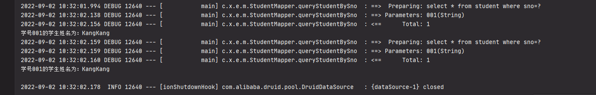
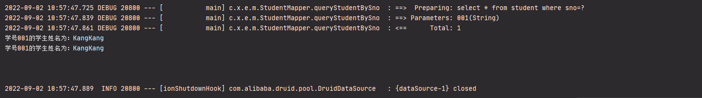

# 10.Spring-Boot-Ehcache-Cache

如九一样配置好

```xml
<dependencies>
    <dependency>
        <groupId>org.springframework.boot</groupId>
        <artifactId>spring-boot-starter</artifactId>
    </dependency>

    <dependency>
        <groupId>mysql</groupId>
        <artifactId>mysql-connector-java</artifactId>
    </dependency>
    <dependency>
        <groupId>org.mybatis.spring.boot</groupId>
        <artifactId>mybatis-spring-boot-starter</artifactId>
        <version>1.3.2</version>
    </dependency>
    <dependency>
        <groupId>com.alibaba</groupId>
        <artifactId>druid-spring-boot-starter</artifactId>
        <version>1.1.13</version>
    </dependency>
    <dependency>
        <groupId>org.springframework.boot</groupId>
        <artifactId>spring-boot-starter-test</artifactId>
        <scope>test</scope>
    </dependency>
</dependencies>
```


2.同9一样的Services,mapper,bean和测试方法




3.添加依赖

```xml
<dependency>
    <groupId>net.sf.ehcache</groupId>
    <artifactId>ehcache-core</artifactId>
    <version>2.6.11</version>
</dependency>
```

4.增加ehcache.xml（ehcache 3之后配置文件改变 [ehcache官网](https://www.ehcache.org/)）

```xml
<?xml version="1.0" encoding="UTF-8"?>
<ehcache xmlns:xsi="http://www.w3.org/2001/XMLSchema-instance"
         xsi:noNamespaceSchemaLocation="ehcache.xsd">
    <defaultCache
            maxElementsInMemory="10000"
            eternal="false"
            timeToIdleSeconds="3600"
            timeToLiveSeconds="0"
            overflowToDisk="false"
            diskPersistent="false"
            diskExpiryThreadIntervalSeconds="120" />

    <cache
            name="student"
            maxEntriesLocalHeap="2000"
            eternal="false"
            timeToIdleSeconds="3600"
            timeToLiveSeconds="0"
            overflowToDisk="false"
            statistics="true"/>
</ehcache>
```


测试结果



