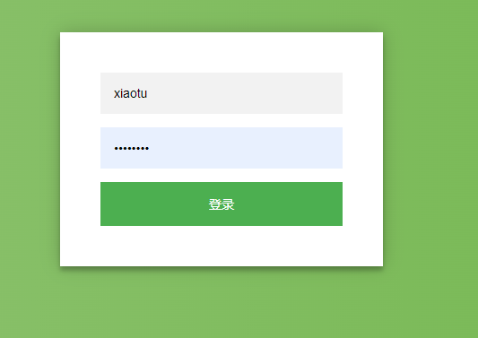
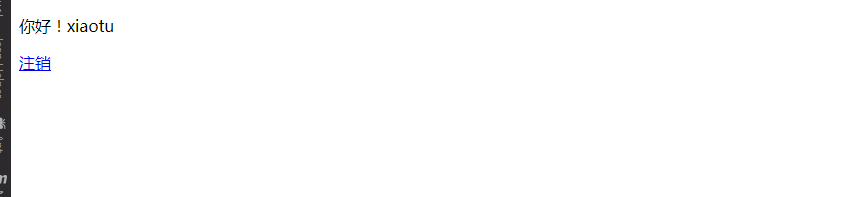

# 11.Spring-Boot-Shiro-Authentication

在Spring Boot中集成Shiro进行用户的认证过程主要可以归纳为以下三点：

1、定义一个ShiroConfig，然后配置SecurityManager Bean，SecurityManager为Shiro的安全管理器，管理着所有Subject；

2、在ShiroConfig中配置ShiroFilterFactoryBean，其为Shiro过滤器工厂类，依赖于SecurityManager；

3、自定义Realm实现，Realm包含`doGetAuthorizationInfo()`和`doGetAuthenticationInfo()`方法，因为本文只涉及用户认证，所以只实现`doGetAuthenticationInfo()`方法


新增shiro-spring依赖

```xml
<!-- shiro-spring -->
<dependency>
    <groupId>org.apache.shiro</groupId>
    <artifactId>shiro-spring</artifactId>
    <version>1.4.0</version>
</dependency>
```


shiro配置类

```java
@Configuration
public class ShiroConfig {

    @Bean
    public ShiroFilterFactoryBean shiroFilterFactoryBean(SecurityManager securityManager){
        ShiroFilterFactoryBean shiroFilterFactoryBean = new ShiroFilterFactoryBean();
        //设置securityManager
        shiroFilterFactoryBean.setSecurityManager(securityManager);
        //登录url
        shiroFilterFactoryBean.setLoginUrl("/login");
        //登录成功后跳转url
        shiroFilterFactoryBean.setSuccessUrl("index");
        //未授权url
        shiroFilterFactoryBean.setUnauthorizedUrl("/403");

        LinkedHashMap<String,String> filterChainDefinitionMap = new LinkedHashMap<>();

        //定义filterChain ,静态资源不拦
        filterChainDefinitionMap.put("/css/**","anon");
        filterChainDefinitionMap.put("/js/**","anon");
        filterChainDefinitionMap.put("/fonts/**","anon");
        filterChainDefinitionMap.put("/img/**","anon");

        //druid数据源监控不拦截
        filterChainDefinitionMap.put("/druid/**","anon");
        //配置退出过滤器
        filterChainDefinitionMap.put("/logout","logout");
        filterChainDefinitionMap.put("/","anon");
        //其他需要认证
        filterChainDefinitionMap.put("/**","authc");

        shiroFilterFactoryBean.setFilterChainDefinitionMap(filterChainDefinitionMap);
        return shiroFilterFactoryBean;
    }

    @Bean
    public SecurityManager securityManager(){
        // 配置
        DefaultWebSecurityManager securityManager = new DefaultWebSecurityManager();
        securityManager.setRealm(shiroRealm());
        return securityManager;
    }

    @Bean
    public ShiroRealm shiroRealm(){
        ShiroRealm shiroRealm = new ShiroRealm();
        return shiroRealm;
    }

}
```

要注意的是filterChain基于短路机制，即最先匹配原则，如：

```
/user/**=anon
/user/aa=authc 永远不会执行
```

`anon`、`authc`等为Shiro为我们实现的过滤器，具体如下表所示：

| Filter Name       | Class                                                        | Description                                                  |
| :---------------- | :----------------------------------------------------------- | :----------------------------------------------------------- |
| anon              | [org.apache.shiro.web.filter.authc.AnonymousFilter](http://shiro.apache.org/static/current/apidocs/org/apache/shiro/web/filter/authc/AnonymousFilter.html) | 匿名拦截器，即不需要登录即可访问；一般用于静态资源过滤；示例`/static/**=anon` |
| authc             | [org.apache.shiro.web.filter.authc.FormAuthenticationFilter](http://shiro.apache.org/static/current/apidocs/org/apache/shiro/web/filter/authc/FormAuthenticationFilter.html) | 基于表单的拦截器；如`/**=authc`，如果没有登录会跳到相应的登录页面登录 |
| authcBasic        | [org.apache.shiro.web.filter.authc.BasicHttpAuthenticationFilter](http://shiro.apache.org/static/current/apidocs/org/apache/shiro/web/filter/authc/BasicHttpAuthenticationFilter.html) | Basic HTTP身份验证拦截器                                     |
| logout            | [org.apache.shiro.web.filter.authc.LogoutFilter](http://shiro.apache.org/static/current/apidocs/org/apache/shiro/web/filter/authc/LogoutFilter.html) | 退出拦截器，主要属性：redirectUrl：退出成功后重定向的地址（/），示例`/logout=logout` |
| noSessionCreation | [org.apache.shiro.web.filter.session.NoSessionCreationFilter](http://shiro.apache.org/static/current/apidocs/org/apache/shiro/web/filter/session/NoSessionCreationFilter.html) | 不创建会话拦截器，调用`subject.getSession(false)`不会有什么问题，但是如果`subject.getSession(true)`将抛出`DisabledSessionException`异常 |
| perms             | [org.apache.shiro.web.filter.authz.PermissionsAuthorizationFilter](http://shiro.apache.org/static/current/apidocs/org/apache/shiro/web/filter/authz/PermissionsAuthorizationFilter.html) | 权限授权拦截器，验证用户是否拥有所有权限；属性和roles一样；示例`/user/**=perms["user:create"]` |
| port              | [org.apache.shiro.web.filter.authz.PortFilter](http://shiro.apache.org/static/current/apidocs/org/apache/shiro/web/filter/authz/PortFilter.html) | 端口拦截器，主要属性`port(80)`：可以通过的端口；示例`/test= port[80]`，如果用户访问该页面是非80，将自动将请求端口改为80并重定向到该80端口，其他路径/参数等都一样 |
| rest              | [org.apache.shiro.web.filter.authz.HttpMethodPermissionFilter](http://shiro.apache.org/static/current/apidocs/org/apache/shiro/web/filter/authz/HttpMethodPermissionFilter.html) | rest风格拦截器，自动根据请求方法构建权限字符串；示例`/users=rest[user]`，会自动拼出user:read,user:create,user:update,user:delete权限字符串进行权限匹配（所有都得匹配，isPermittedAll） |
| roles             | [org.apache.shiro.web.filter.authz.RolesAuthorizationFilter](http://shiro.apache.org/static/current/apidocs/org/apache/shiro/web/filter/authz/RolesAuthorizationFilter.html) | 角色授权拦截器，验证用户是否拥有所有角色；示例`/admin/**=roles[admin]` |
| ssl               | [org.apache.shiro.web.filter.authz.SslFilter](http://shiro.apache.org/static/current/apidocs/org/apache/shiro/web/filter/authz/SslFilter.html) | SSL拦截器，只有请求协议是https才能通过；否则自动跳转会https端口443；其他和port拦截器一样； |
| user              | [org.apache.shiro.web.filter.authc.UserFilter](http://shiro.apache.org/static/current/apidocs/org/apache/shiro/web/filter/authc/UserFilter.html) | 用户拦截器，用户已经身份验证/记住我登录的都可；示例`/**=user` |


## Realm

自定义Realm实现只需继承AuthorizingRealm类，然后实现doGetAuthorizationInfo()和doGetAuthenticationInfo()方法即可。这两个方法名乍看有点像，authorization发音[ˌɔ:θəraɪˈzeɪʃn]，为授权，批准的意思，即获取用户的角色和权限等信息；authentication发音[ɔ:ˌθentɪ’keɪʃn]，认证，身份验证的意思，即登录时验证用户的合法性，比如验证用户名和密码。

```java

public class ShiroRealm extends AuthorizingRealm {

    @Autowired
    private UserMapper userMapper;
    /**
     * 获取用户角色和权限
     */
    @Override
    protected AuthorizationInfo doGetAuthorizationInfo(PrincipalCollection principal) {
        return null;
    }

    /**
     * 登录认证
     */
    @Override
    protected AuthenticationInfo doGetAuthenticationInfo(AuthenticationToken token) throws AuthenticationException {
        // 获取用户输入的账号和密码
        String userName = (String) token.getPrincipal();
        String password = new String((char[]) token.getCredentials());

        System.out.println("用户" + userName + "认证-----ShiroRealm.doGetAuthenticationInfo");
        User user = userMapper.findByUserName(userName);

        if (user == null) {
            throw new UnknownAccountException("用户名或密码错误！");
        }
        if (!password.equals(user.getPassword())) {
            throw new IncorrectCredentialsException("用户名或密码错误！");
        }
        if (user.getStatus().equals("0")) {
            throw new LockedAccountException("账号已被锁定,请联系管理员！");
        }
        SimpleAuthenticationInfo info = new SimpleAuthenticationInfo(user, password, getName());
        return info;
    }

}
```





