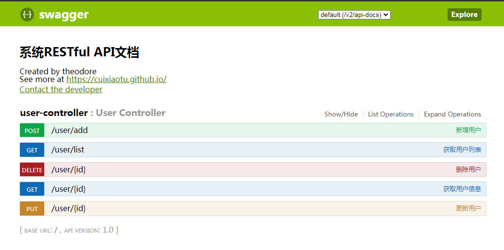

# 20.Spring-Boot-Swagger2

Swagger是一款可以快速生成符合RESTful风格API并进行在线调试的插件。本文将介绍如何在Spring Boot中整合Swagger。

在此之前，我们先聊聊什么是**REST**。REST实际上为**Re**presentational **S**tate **T**ransfer的缩写，翻译为“表现层状态转化” 。如果一个架构符合REST 原则，就称它为**RESTful**架构。

实际上，“表现层状态转化”省略了主语，完整的说应该是“资源表现层状态转化”。什么是资源（Resource）？资源指的是网络中信息的表现形式，比如一段文本，一首歌，一个视频文件等等；什么是表现层（Reresentational）？表现层即资源的展现在你面前的形式，比如文本可以是JSON格式的，也可以是XML形式的，甚至为二进制形式的。图片可以是gif，也可以是PNG；什么是状态转换（State Transfer）？用户可使用URL通过HTTP协议来获取各种资源，HTTP协议包含了一些操作资源的方法，比如：GET 用来获取资源， POST 用来新建资源 , PUT 用来更新资源， DELETE 用来删除资源， PATCH 用来更新资源的部分属性。通过这些HTTP协议的方法来操作资源的过程即为状态转换。

下面对比下传统URL请求和RESTful风格请求的区别：

| 描述 | 传统请求                      | 方法 | RESTful请求       | 方法   |
| :--- | :---------------------------- | :--- | :---------------- | :----- |
| 查询 | /user/query?name=mrbird       | GET  | /user?name=mrbird | GET    |
| 详情 | /user/getInfo?id=1            | GET  | /user/1           | GET    |
| 创建 | /user/create?name=mrbird      | POST | /user             | POST   |
| 修改 | /user/update?name=mrbird&id=1 | POST | /user/1           | PUT    |
| 删除 | /user/delete?id=1             | GET  | /user/1           | DELETE |

从上面这张表，我们大致可以总结下传统请求和RESTful请求的几个区别：

1. 传统请求通过URL来描述行为，如create，delete等；RESTful请求通过URL来描述资源。
2. RESTful请求通过HTTP请求的方法来描述行为，比如DELETE，POST，PUT等，并且使用HTTP状态码来表示不同的结果。
3. RESTful请求通过JSON来交换数据。

RESTful只是一种风格，并不是一种强制性的标准。


## 引入Swagger依赖

```xml
<dependency>
    <groupId>io.springfox</groupId>
    <artifactId>springfox-swagger2</artifactId>
    <version>2.7.0</version>
</dependency>
<dependency>
    <groupId>io.springfox</groupId>
    <artifactId>springfox-swagger-ui</artifactId>
    <version>2.7.0</version>
</dependency>
```


## 配置SwaggerConfig

使用JavaConfig的形式配置Swagger：

```java
@Configuration
@EnableSwagger2
public class SwaggerConfig {

    @Bean
    public Docket buildDocket(){
        return new Docket(DocumentationType.SWAGGER_2)
                .apiInfo(buildApiInf())
                .select()
                .apis(RequestHandlerSelectors.basePackage("com.example.demo.controller"))
                .paths(PathSelectors.any())
                .build();
    }

    private ApiInfo buildApiInf() {
        return new ApiInfoBuilder()
                .title("系统RESTful API文档")
                .contact(new Contact("theodore", "https://cuixiaotu.github.io/", "616364596@qq.com"))
                .version("1.0")
                .build();
    }
}
```


## Swagger常用注解

- `@Api`：修饰整个类，描述Controller的作用；
- `@ApiOperation`：描述一个类的一个方法，或者说一个接口；
- `@ApiParam`：单个参数描述；
- `@ApiModel`：用对象来接收参数；
- `@ApiProperty`：用对象接收参数时，描述对象的一个字段；
- `@ApiResponse`：HTTP响应其中1个描述；
- `@ApiResponses`：HTTP响应整体描述；
- `@ApiIgnore`：使用该注解忽略这个API；
- `@ApiError` ：发生错误返回的信息；
- `@ApiImplicitParam`：一个请求参数；
- `@ApiImplicitParams`：多个请求参数。


## 编写RESTful API接口

Spring Boot中包含了一些注解，对应于HTTP协议中的方法：

- `@GetMapping`对应HTTP中的**GET**方法；
- `@PostMapping`对应HTTP中的**POST**方法；
- `@PutMapping`对应HTTP中的**PUT**方法；
- `@DeleteMapping`对应HTTP中的**DELETE**方法；
- `@PatchMapping`对应HTTP中的**PATCH**方法。


```java
@Api(value = "用户Controller")
@Controller
@RequestMapping("user")
public class UserController {

    @ApiIgnore
    @GetMapping("hello")
    public @ResponseBody
    String hello(){
        return "hello";
    }

    @ApiOperation(value = "获取用户信息", notes = "根据用户id获取用户信息")
    @ApiImplicitParam(name = "id", value = "用户id", required = true, dataType = "Long", paramType = "path")
    @GetMapping("/{id}")
    public @ResponseBody User getUserById(@PathVariable(value = "id") Long id) {
        User user = new User();
        user.setId(id);
        user.setName("mrbird");
        user.setAge(25);
        return user;
    }

    @ApiOperation(value = "获取用户列表", notes = "获取用户列表")
    @GetMapping("/list")
    public @ResponseBody
    List<User> getUserList() {
        List<User> list = new ArrayList<>();
        User user1 = new User();
        user1.setId(1l);
        user1.setName("mrbird");
        user1.setAge(25);
        list.add(user1);
        User user2 = new User();
        user2.setId(2l);
        user2.setName("scott");
        user2.setAge(29);
        list.add(user2);
        return list;
    }

    @ApiOperation(value = "新增用户", notes = "根据用户实体创建用户")
    @ApiImplicitParam(name = "user", value = "用户实体", required = true, dataType = "User")
    @PostMapping("/add")
    public @ResponseBody
    Map<String, Object> addUser(@RequestBody User user) {
        Map<String, Object> map = new HashMap<>();
        map.put("result", "success");
        return map;
    }

    @ApiOperation(value = "删除用户", notes = "根据用户id删除用户")
    @ApiImplicitParam(name = "id", value = "用户id", required = true, dataType = "Long", paramType = "path")
    @DeleteMapping("/{id}")
    public @ResponseBody Map<String, Object> deleteUser(@PathVariable(value = "id") Long id) {
        Map<String, Object> map = new HashMap<>();
        map.put("result", "success");
        return map;
    }

    @ApiOperation(value = "更新用户", notes = "根据用户id更新用户")
    @ApiImplicitParams({
            @ApiImplicitParam(name = "id", value = "用户id", required = true, dataType = "Long", paramType = "path"),
            @ApiImplicitParam(name = "user", value = "用户实体", required = true, dataType = "User") })
    @PutMapping("/{id}")
    public @ResponseBody Map<String, Object> updateUser(@PathVariable(value = "id") Long id, @RequestBody User user) {
        Map<String, Object> map = new HashMap<>();
        map.put("result", "success");
        return map;
    }

}
```


## 启动&测试

启动项目，访问http://localhost:8080/swagger-ui.html即可看到Swagger给我们生成的API页面：


